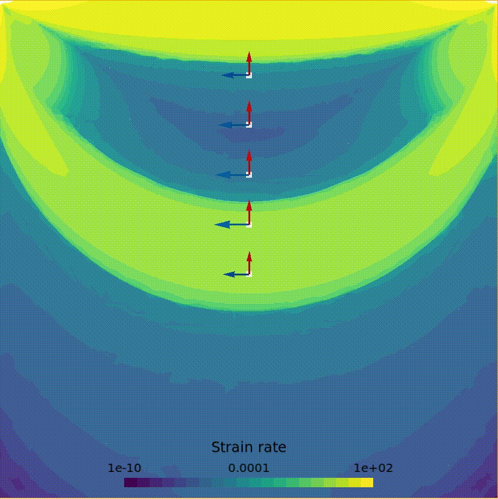
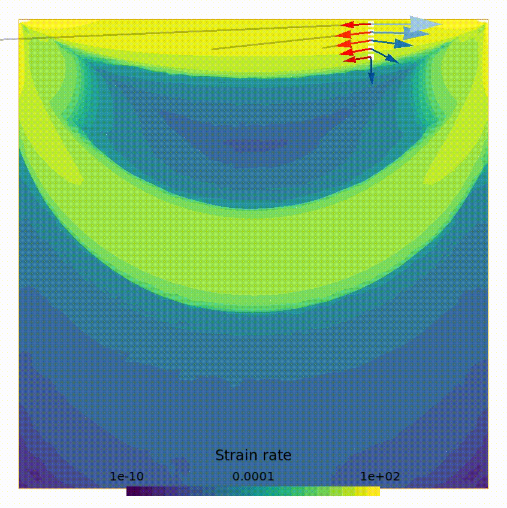
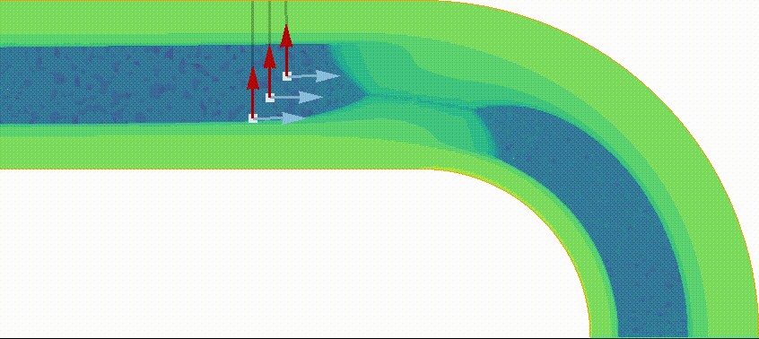
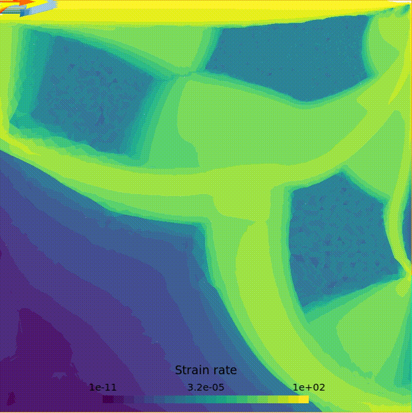

# Bingham flow simulation - Master's thesis

This work covers the topic of simple yield stress fluids described by the Bingham model. The work focuses on the solid-liquid interface that appears in the flows of these fluids. An interface tracking algorithm was developed for such 2D flows using the X-MESH idea, which allows extreme deformations of meshes in order to improve the accuracy of the simulations at low computational costs. The flow simulations are based on a variational approach and a finite element discretization. The resulting conic optimization problem is solved with an interior-point method.

## Structure

    ├── anim              <- Animations in .mp4 or .gif
    ├── docs              <- Documents, reference books
    ├── figures           <- Figures describing various flows
    ├── mesh              <- 2D meshes produced with gmsh
    ├── presentation      <- Slides for presentation
    ├── report            <- Report in .tex and .pdf
    ├── res               <- Results of simulations saved in .txt files
    ├── scripts           <- Scripts for theory analysis (independent of the simulations)
    └── src               <- Source code for the simulations (1D and 2D)

## Launch a simulation
The source code in `Python` must be executed from the `src` directory:

1. __Create a mesh__ with `generate_mesh.py`, where you define the geometry and the type of boundary conditions
2. __Specify the boundary conditions__ of your problem in `bingham_boundary_conditions.py` with numerical values
3. __Choose a mode__ in `bingham_run.py`
    1. Compute the flow once
    2. Compute the flow iteratively with the interface-tracking algorithm
    3. Load the results of a simulation previously saved in `./res/`
4. __Set some parameters__ in `bingham_run.py`
    - The consistency $K$
    - The yield stress $\tau_0$
    - The element: Taylor-Hood or Mini
    - The name of the mesh in `./mesh/`

## Post-processing
The post-processing is done with `Gmsh`. Multiple views are available to visualize the flow:
- Velocity
- Streamlines
- Strain rate tensor (components and norm)
- Vorticity
- Pressure
- Unyielded regions
- Boundary shear forces
- ...

Figures are easily generated with `Gmsh` in various formats: `.png`, `.pdf`, `.svg`, ...

The animations display particles in the flow field, with their velocity (blue) and acceleration (red) vectors, and the radius of curvature of their trajectory if required. This can be enabled in `./src/bingham_post_pro.py`. Animations are saved as a series of `.png` frames in `./anim/`.

To generate a `.mp4` video from the frames, with `FFmpeg`:
```
ffmpeg -framerate 25 -i frame_%04d.png -vcodec libx264 -vf "pad=ceil(iw/2)*2:ceil(ih/2)*2" -crf 5 -r 25 -pix_fmt yuv420p anim.mp4
```

To convert the `.mp4` to a `.gif`, with `FFmpeg`:
```
ffmpeg -i anim.mp4 -f gif anim.gif
```

## Dependencies
The solver uses the  open-source `CVXOPT` library in the 1D problem, and the `MOSEK Optimizer API for Python` in the 2D problem.

<br />

# Examples
## Lid driven cavity


## Lid driven cavity, display radius of curvature


## Flow in a pipe


## Lid driven cavity, open at the upper left and lower right boundaries
